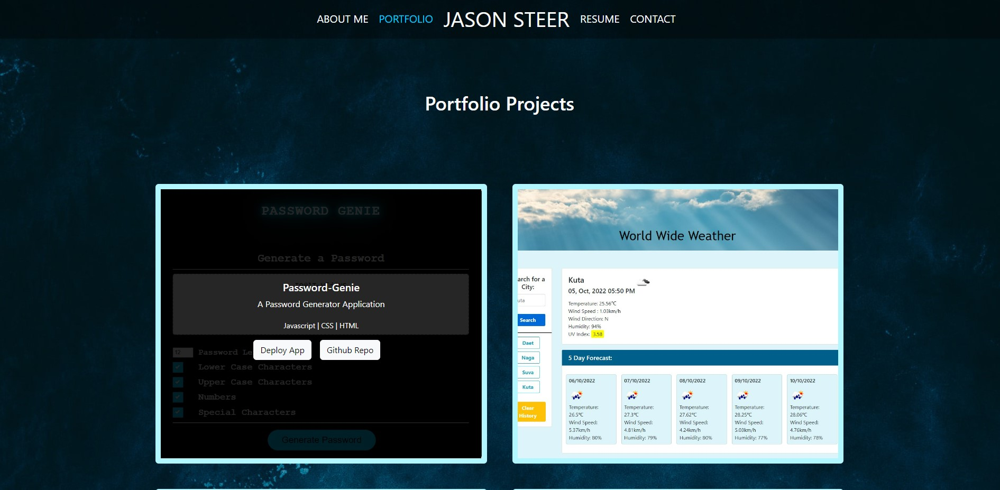

  <h1 align="center">Portfolio DevJS<h1>

  

  ## TABLE OF CONTENTS
  - [Description](#description)
  - [Application-Link](#application-deployment-links)
  - [Installation](#Installation)
  - [Usage](#Usage)
  - [Media](#Media)
  - [License](#License)
  - [Contributors](#contributors)
  - [Questions](#Questions)

  ## DESCRIPTION
  The aim of this project was to create a Movie Guide.
  Phase One: Was a focus on allowing users to keep track of upcoming and movies that have recently released and with information on where to watch them.

  Phase Two: Was a focus on providing the functionality for the user to be able to rate and review movies. We also gave the user the ability to view which movies they have rated and reviewed.
  
  Phase Three: A future focus for the application will be on providing a watchlist feature where the User is able to add whatever movie they desire and set it to plan to watch or already watched. Planned movies may be set in three tiers of priority: Low, Medium and High. Within those tiers the user will be able to drag and rop the movies into an order of priority. Users will also be able to later on view other users profiles.
  
  ## Application Deployment Links:

  Deployed Application at: [Portfolio.DevJS](https://eljsteer.github.io/portfolio.devjs/)

  ## INSTALLATION
  To install the application to view the code:

  ##### From GitHub:

  1. Install NodeJS here: [Download NodeJS](https://nodejs.org/en/download/)

  ##### In your terminal:  
  2. To install the required NPM packages to run the backend functionality, Type `npm install` in the command line to install associated npm packages and node modules to be able to download all required packages under "dependencies in the "package.json" file.

  ## Usage

  # Getting Started with Create React App

  This project was bootstrapped with [Create React App](https://github.com/facebook/create-react-app).

  ## Available Scripts

  In the project directory, you can run:

  ### `npm start`

  Runs the app in the development mode.\
  Open [http://localhost:3000](http://localhost:3000) to view it in your browser.

  The page will reload when you make changes.\
  You may also see any lint errors in the console.

  ### `npm test`

  Launches the test runner in the interactive watch mode.\
  See the section about [running tests](https://facebook.github.io/create-react-app/docs/running-tests) for more information.

  ## MEDIA
  #### Screenshot of Homepage
  

  #### Screenshot of Projects Page
  

  ## LICENSE
  Project developed 2022 by Jason Steer, 
  This application is licensed under the Apache 2.0 license.
  
  ## Credits
  - [Katy DeCorah](https://codepen.io/katydecorah/pen/oNeZMN)
  - [emailRegex](https://emailregex.com/)
  - [Eric Murphy | Youtube](https://www.youtube.com/watch?v=aor9hlcODUE)
  - [Css.Glass](https://css.glass/)
  - [Exerror](https://exerror.com/how-to-download-file-in-react-js/#:~:text=To%20Download%20File%20in%20React%20js%20In%20React%20Router%20You,Now%2C%20You%20can%20download%20file.)

  ## QUESTIONS
  For any questions on this project please contact me via my Github link or email. 

  **Find me on GitHub - UserName:** [eljsteer](https://github.com/eljsteer) 
  **Email me with any questions:** el.jsteer@gmail.com 
   
  
  _This README was generated with ❤️ by [LA-README-ZY](https://github.com/eljsteer/LA-README-ZY)_

